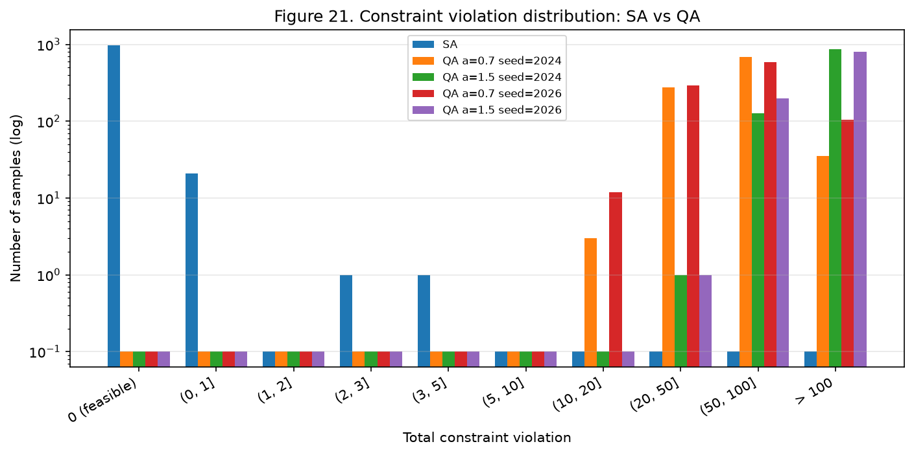

# CFLP Formulation: Quantum Annealing으로 시설 입지 문제 풀기

Capacitated Facility Location Problem(CFLP)을 **Single-source(SS)** 와
**Multiple-source(MS)** 두 formulation으로 모델링하고, 원래 MILP는 **Gurobi**로,
같은 문제를 QUBO로 변환한 뒤에는 **Simulated Annealing(SA)** 과
**Quantum Annealing(QA, D-Wave Advantage / Advantage2)** 으로 해결해 비교한
연구용 코드베이스이다.

이 저장소의 핵심 주장은 두 가지다.

**모든 constraint에 같은 penalty coefficient를 쓰는 관행이 QA 실패의 주된
원인이다.** constraint마다 계수 크기가 달라 제곱 후 증폭 정도가 다르므로, 같은
λ를 써도 하드웨어가 보는 제약 강도가 10³~10⁴배까지 벌어진다. 이를 보정하면
QA가 SS 4×4에서 **최적해**를, 6×6에서 **gap 2.95%** 를 찾는다. 보정 전에는
둘 다 실패했다.

**그럼에도 MS는 어떤 보정으로도 풀리지 않는다.** embedding과 chain break가
모두 정상인데도 feasible solution이 0개이고, 제약 위반량의 중앙값이 총수요의
27%에 달한다. 원인은 coefficient dynamic range이며, 이것은 penalty 방식의
구조적 귀결이다.

이 README의 모든 수치는 `results/` 아래 CSV에서 직접 읽은 값이다.

---

## 결과 1: penalty 균형 보정이 QA를 살린다

`capacity` penalty를 고정한 채 `assignment` penalty에만 배수(ratio)를 곱한
결과다. 실제 QPU 실행이며, `results/processed/penalty_balance.csv`에 있다.

| instance | ratio=1 (기존) | 최적 ratio | 개선 |
|---|---|---|---|
| **SS 4×4** | feasible 0.4%, gap 0.4% | ratio 1000 → feasible **6.7%**, gap **0.0%** | 최적해 발견 |
| **SS 6×6** | feasible **0%** | ratio 1000 → feasible **2.5%**, gap **2.95%** | 0에서 발생 |
| SS 8×8 | 0% | 모든 ratio에서 0% | — |
| SS 15×15 | 0% | 모든 ratio에서 0% | — |

**ratio 1000까지 coefficient range는 전혀 변하지 않는다.** 4×4·6×6은
`5.96×10⁷`·`1.51×10⁸`으로 고정이고, ratio 5000에서야 늘기 시작한다.
즉 **dynamic range를 대가로 치르지 않고 얻은 개선**이다.

SA로도 같은 경향이 나타난다(오프라인, `mode=offline`).

| instance | ratio=1 | 최적 ratio | 배수 |
|---|---|---|---|
| SS 4×4 | 0.9% | 25.5% (ratio 500) | ×28 |
| SS 6×6 | 0.2% | 40.5% (ratio 500) | ×203 |
| SS 8×8 | 0.2% | 44.4% (ratio 500) | ×222 |
| SS 15×15 | 0.0% | 5.4% (ratio 500) | 0에서 발생 |

### 왜 이런 일이 생기는가

| constraint | 제곱 후 계수 규모 | 8×8 정규화 강도 (ratio=1) |
|---|---|---|
| capacity | `λ · s_j²` | 0.83 ~ 4.56 |
| assignment (SS) | `λ` | **4.3 × 10⁻⁴** |

SS의 assignment constraint는 계수가 전부 1이라 `λ`가 그대로 남는 반면,
capacity는 `s_j`가 제곱되어 증폭된다. 비율이 정확히 `2/s_max²`다.

auto_scale 이후로 보면 assignment 계수가 `4.3×10⁻⁴`인데 ICE 노이즈는 `10⁻²`
수준이다. **하드웨어는 capacity만 보고 assignment는 사실상 보지 못한다.**
ratio를 올려 assignment 강도를 0.2~0.8 구간으로 끌어올리면 노이즈 위로 올라온다.

penalty method가 요구하는 것은 각 constraint에 대해 `λ_k > Z_ub`이지
"모든 constraint가 같은 λ"가 아니므로 **원칙 위반이 아니라 더 정확한 적용**이다.

### MS에는 적용되지 않는다 (반증 대조군)

MS의 demand constraint는 계수가 binary expansion weight(최대 16)와 상수항
`d_i`(최대 44)라 이미 증폭되어 있다. capacity 대비 비율이 SS의 `9.4×10⁻⁵`와
달리 `6.6×10⁻²`로, **이미 균형이 맞아 있다.** 보정하면 오히려 나빠진다.

이 대조 덕분에 SS의 개선이 우연이 아니라 **구조적 불균형을 고친 결과**임이
확인된다.

---

## 결과 2: MS는 하드웨어 정밀도에 막힌다

MS 6×6은 Pegasus에 embedding된다(4,503 물리 큐빗, chain break 1.5~2.1%).
그런데 1,000회 샘플링에서 feasible solution이 **0개**다.

같은 QUBO를 SA로 풀었을 때와 제약 위반량 분포를 비교하면 이렇다.
(`results/processed/ms6x6_violation_summary.csv`)



| | SA | QA α=0.7 | QA α=1.5 |
|---|---|---|---|
| 최소 위반량 | **0** | 11 ~ 14 | 34 ~ 47 |
| 중앙값 | **0** | 61 ~ 63.5 | 128.5 ~ 138 |
| 최대 위반량 | **4** | 135 ~ 144 | 258 ~ 314 |
| feasible 비율 | **97.7%** | 0% | 0% |
| 위반 ≤ 10인 sample | **1,000 / 1,000** | **0** | **0** |

**QA의 최소 위반량이 SA의 최대 위반량보다 크다.** 두 분포는 겹치지 않는다.
QA 쪽 1,000개 중 위반 10 이하가 하나도 없으므로, "아깝게 못 맞춘 것"이 아니라
**근처에도 가지 못한다.** 중앙값 61은 총수요 226의 27%다.

같은 QUBO, 같은 제약, 같은 penalty이므로 차이는 하드웨어뿐이다.

### 원인 후보를 하나씩 지웠다

| 후보 | 판정 | 근거 |
|---|---|---|
| QUBO 변환 오류 | ✗ | 검증 26건 통과 (energy 항등식 상대오차 4.4e-14) |
| 이산화 손실 | ✗ | 네 instance 모두 정확히 0 (아래 참조) |
| embedding 실패 | ✗ | 4,503 큐빗으로 성공 |
| chain break | ✗ | 1.3~2.1% |
| annealing time | ✗ | 20→200μs, 10배 무효 |
| num_reads | ✗ | 1,000→2,000 무효 |
| chain strength α | ✗ | 1.5→0.7에서 위반량 2배 개선, 여전히 0개 |
| **coefficient range** | **✓** | 남은 유일한 후보 |

α sweep은 일관된 효과를 보인다. α를 낮추면 chain break가 오르는 대신
(0.7%→16.7%) 위반량이 줄어, α=0.7 부근에서 최소가 된다. 하지만 개선폭이
2배일 뿐 **0에 도달하지 못한다.** 등식 제약이라 근사가 소용없다.

---

## 결과 3: embedding을 가르는 것은 변수 수가 아니라 graph density

MS 6×6은 논리변수 **259개**로 Pegasus 성공률이 52%인데, SS 15×15는 **329개**로
embedding에 성공한다. 변수가 더 많은 쪽이 들어간다.

6×6에서 이차항이 SS 571개, MS 8,701개로 **15배** 차이나기 때문이다. MS는
`q_ij`를 binary expansion하면서 한 constraint 안의 항이 늘고, 제곱 전개 시
이차항이 **항 수의 제곱**으로 늘어난다.

| instance | SS 변수 / 이차항 | MS 변수 / 이차항 |
|---|---|---|
| 4×4 | 44 / 246 | 120 / 2,540 |
| 6×6 | 79 / 571 | 259 / 8,701 |
| 8×8 | 117 / 1,030 | 413 / 17,603 |
| 15×15 | 329 / 5,026 | 1,439 / 123,857 |

### Zephyr 실패의 원인은 용량이 아니라 working graph다

MS 6×6 embedding 탐색 결과다. (`results/processed/embedding_study.csv`,
`embedding_dry_study.csv`)

| target | 시행 | 성공률 | 물리 큐빗(중앙값) | 최대 chain |
|---|---|---|---|---|
| Pegasus (실제 Advantage) | 25 | **52%** | 4,675 | 40 |
| Zephyr (실제 Advantage2) | 40 | **0%** | — | — |
| **Zephyr Z12 (이상적 그래프)** | 5 | **80%** | **3,644** | 27 |

**이상적 Zephyr는 3,644 큐빗으로 성공한다.** 실제 Advantage2의 가용 큐빗
4,577개보다 작으므로 **용량 부족이 아니다.** Pegasus의 4,675개보다도 22% 적고
chain도 짧다. 연결도가 높은 이점이 실제로 나타난다.

그런데 실제 Advantage2에서는 40회 전부 실패했다. 차이는 **결함 큐빗**뿐이다
(이상적 4,800 대 실제 4,577, 4.6% 차이). 결함이 탐색을 막는 것으로 보인다.

8×8 이상은 두 topology 모두 실패했다. Pegasus에서 6×6의 overhead(18.1)를 그대로
적용해도 413 × 18.1 ≈ 7,450 큐빗이 필요해 가용량 5,627을 넘는다.

**minorminer는 heuristic이므로 탐색 실패를 embedding 불가능의 증명으로 해석하지
않는다.** 이 저장소의 "실패"는 모두 "주어진 예산 안에서 찾지 못했다"는 뜻이다.

---

## 결과 4: 1 unit discretization 손실은 구조적으로 0

`y`를 고정하면 남는 `q` 문제는 transportation problem이고 그 제약행렬은
**totally unimodular**이다. demand와 capacity가 정수이므로 LP 최적해가 이미
정수점에 놓인다. 네 instance 모두 연속 해의 소수부가 정확히 0이었고,
`MS`와 `MS-int-q`의 목적값이 완전히 일치했다.

따라서 QUBO 해의 gap은 **이산화가 아니라 solver 품질**에서 온 것으로 귀속된다.

---

## 결과 5: feasibility와 solution quality는 반대 방향을 가리킨다

본 실험(parameter 고정, `linking=False`) 결과다. (`results/processed/all_results.csv`)

| | SS feasible | SS gap | MS feasible | MS gap |
|---|---|---|---|---|
| 4×4 | 0.9% | 7.29% | 89.7% | 29.24% |
| 6×6 | 0.2% | 22.54% | 97.7% | 30.86% |
| 8×8 | 0.2% | 33.38% | 90.9% | 84.28% |
| 15×15 | 0.0% | 해 없음 | 99.9% | 83.04% |

MS는 constraint를 훨씬 쉽게 만족시키지만 optimality gap은 오히려 크다.
**"어느 formulation이 나은가"에 한 문장으로 답할 수 없다.**

같은 표의 QA 열은 이렇다. SS 4×4만 feasible solution을 냈고(0.3%, gap 27.06%),
나머지는 0%이거나 `NOT_EMBEDDABLE`이다. 위의 **결과 1**에서 penalty를 보정하면
이 값이 크게 달라진다.

---

## 결과 6: 계수 dynamic range는 penalty 방식의 구조적 귀결

```
range ≈ (λ / c_min) × s_max²
         penalty 우위      제곱
```

| instance | penalty 우위 | 제곱 | 합계 | 하드웨어 |
|---|---|---|---|---|
| 4×4 | 5.2 bit | 12.3 bit | **17.5 bit** | |
| 6×6 | 7.2 bit | 12.2 bit | **19.5 bit** | 약 5 bit |
| 8×8 | 8.2 bit | 14.4 bit | **22.6 bit** | |
| 15×15 | 8.4 bit | 13.7 bit | **22.1 bit** | |

시도해 본 개선책과 실측 효과다.

| 방법 | 효과 | 비고 |
|---|---|---|
| **constraint별 λ 균형** | **QA가 SS 4×4·6×6을 해결** | range 불변. 가장 효과적 |
| chain strength α (1.5 → 0.7) | 위반량 2배 개선 | 실측. feasible에는 도달 못 함 |
| tighter λ (`λ > Z_ub`) | 2.2 bit | rigorous, 무료. 미실행 |
| big-M 재구성 | 0.5 bit | 상수항 교차로 대부분 상쇄 |
| resolution 조정 | — | **이 문제에서는 불가능** |
| 균등 스케일링 / gcd | 0 bit | 비율 불변, `auto_scale`이 이미 수행 |

resolution을 키우면 range가 줄지만, MS의 demand constraint가 등식이라
`Σ_j q_ij = d_i`를 만족할 수 없게 된다. demand가 44인 customer가 있으면
δ=2에서도 15명 중 5명이 표현 불가능해진다.

**`λ`와 `s_max²`는 penalty method를 쓰는 한 줄일 수 없다.** `λ ≥ Z_ub`는 정의상
필수이고, 제곱은 penalty 형태 자체에서 온다. 남은 레버를 다 써도 3~4비트이며,
필요한 것은 12~17비트다.

---

## 재현성에 관한 경고

**QPU embedding 실험은 working graph를 명시하지 않으면 재현되지 않는다.**

동일 solver(`Advantage_system6`), 동일 seed, 동일 tries에서 `graph_id`가 다르다는
이유만으로 성공률이 갈렸다.

| seed | graph A (tries=5) | graph A (tries=10) | graph B (tries=10) |
|---|---|---|---|
| 2024 | 실패 | **성공** | 실패 |
| 2025 | 성공 | 성공 | **실패** |
| 2026 | 실패 | **성공** | 성공 |
| 성공률 | 3/5 | **5/5** | 3/5 |

같은 graph에서는 성공한 embedding의 물리 큐빗 수와 chain 길이가 **소수점 열두
자리까지 동일**하게 재현됐다(tries=10이 tries=5의 궤적을 포함). graph가 다르면
전혀 다른 결과가 나온다.

`graph_id`는 **지정할 수 없다.** QPU 교정 과정에서 갱신되기 때문이다. 그래서 이
저장소는 `graph_fingerprint()`로 엣지 집합의 지문을 기록하고,
`validate_embedding()`으로 저장된 mapping이 현재 그래프에서 유효한지 검사한다.
성공한 embedding mapping은 통계와 별도로 JSON에 저장한다.

---

## Formulation

### SS-CFLP

```
min  Σ_j f_j y_j + Σ_i Σ_j c_ij d_i x_ij
(A)  Σ_j x_ij = 1                    ∀i     single assignment
(C)  Σ_i d_i x_ij ≤ s_j y_j          ∀j     capacity
     x_ij ∈ {0,1},  y_j ∈ {0,1}
```

### MS-CFLP

`x_ij ∈ [0,1]` (continuous)인 것만 다르고 나머지는 동일하다.

### 두 formulation의 목적함수를 통일한 이유

SS의 운송비를 `c_ij x_ij`로 두면 customer를 어디에 배정하든 **demand와 무관하게**
거리 비용만 부담하게 되어, demand 60인 customer와 20인 customer의 운송비가 같아진다.
그러면 두 formulation이 같은 문제의 두 버전이 아니라 서로 다른 문제가 된다.

SS도 `c_ij d_i x_ij`를 쓰면 SS는 정확히 **"MS에서 x를 binary로 제한한 문제"** 가
되어 다음 관계가 항상 성립하며, 이를 구현 검증에 쓴다.

```
Obj_MS ≤ Obj_MS-int-q ≤ Obj_SS
```

### linking constraint

`x_ij ≤ y_j`는 **redundant**하다. capacity constraint에서 `y_j = 0`이면 좌변이
0 이하가 되고 `d_i > 0`, `x_ij ≥ 0`이므로 모든 `x_ij = 0`이 강제된다.
기본 설정에서는 제외하며, `include_linking=True`로 비용을 측정할 수 있다.

| instance | SS 변수 | SS+link | MS 변수 | MS+link |
|---|---|---|---|---|
| 4×4 | 44 | 60 | 120 | 212 |
| 6×6 | 79 | 115 | 259 | 475 |
| 8×8 | 117 | 181 | 413 | 773 |
| 15×15 | 329 | 554 | 1,439 | 2,774 |

MS가 훨씬 크게 손해를 본다. SS는 slack이 1비트면 되지만 MS는 `q_ij ≤ d_i y_j`라
slack 범위가 `[0, d_i]`여서 5~6비트가 필요하다.

**측정된 SA 영향**은 MS에 집중된다. feasible 비율이 89.7→63.0, 97.7→65.3,
90.9→59.7, 99.9→58.8%로 떨어진다. SS는 0.9→0.8, 0.2→0.3, 0.2→0.3, 0→0으로
거의 변화가 없다. feasible region은 동일하므로 이 차이는 전부 **QUBO 표현의
비용**이다.

---

## QUBO 변환

### unit 표현 (1 unit shipment precision)

```
q_ij = d_i x_ij   ⟹   q_ij ∈ {0, 1, ..., d_i},   x_ij = q_ij / d_i
```

정수 전환 자체는 변수를 늘리지 않는다(`x_ij` 225개 → `q_ij` 225개).
변수를 늘리는 것은 그다음의 binary expansion이다. 15×15 MS의 변수 1,439개 중
**1,335개(93%)가 encoding 변수**이고 slack은 89개로 SS와 같다.

### truncated binary expansion

```
K = bit_length(U)
w = [2^0, 2^1, ..., 2^(K-2), U − (2^(K-1) − 1)]
q = Σ_k w_k z_k
```

마지막 계수를 그대로 `2^(K-1)`로 두면 표현 최댓값이 `2^K − 1`이 되어 `U`를
초과한다. 잘라내면 `Σ_k w_k = U`가 되어 범위가 정확히 `[0, U]`다.

**완전성**: 앞의 `K−1`개 계수가 `0 … 2^(K-1)−1`을 빠짐없이 표현하고,
`w_last = U − 2^(K-1) + 1 ≤ 2^(K-1)`이므로 마지막 비트를 켠 구간이 앞 구간과
겹치거나 맞닿는다. `validate_encoding_completeness`가 실제 등장하는 모든 상한에
대해 전수 확인한다.

예: `U = 35` → `w = [1, 2, 4, 8, 16, 4]` (6비트, 합 35)

**encoding은 coefficient range에 거의 영향을 주지 않는다.** encoding weight의
최댓값은 변수의 range에 묶여 있어 `q_ij ∈ [0,44]`면 최대 16인 반면, 지배항은
`s_j`에서 온다. 실제로 8×8과 15×15는 SS와 MS의 계수 범위가
`7.21×10⁸`, `1.58×10⁹`으로 **완전히 같다.** 변수 수는 3.5배, 4.4배 차이나는데도.

### penalty coefficient

```
U_obj = Σ_j f_j + Σ_i Σ_j c_ij d_i
λ     = margin × U_obj,   margin = 1.1  (설정 파일 고정)
```

**더 tight한 유효 하한이 존재한다.** infeasible solution의 energy는 최소 `λ`인
반면 optimal solution의 energy는 알려진 feasible solution의 objective `Z_ub`
이하이므로, `λ > Z_ub`이면 ground state가 feasible임이 보장된다. 8×8에서
`U_obj` 기준 λ(18,024.6)는 `Z_ub`(3,952.5)의 4.56배로 필요한 것보다 4.5배 크다.

본 실험은 λ를 grid search 하지 않으며, 진단 실험(notebook 10~13)에서만
의도적으로 변화시키고 그 값을 본 실험 설정으로 채택하지 않는다.

---

## 데이터 생성

Cornuéjols–Sridharan–Thizy(1991) 계열의 CFLP instance generation을 따른다.

| 항목 | 방식 |
|---|---|
| location | customer, facility 모두 `U[0,1] × U[0,1]` |
| demand | `Normal(35, 5)` → 반올림 → 최소 1로 clip |
| capacity | `Uniform[10,160]` → `Σ_j s_j = 1.5 Σ_i d_i` 가 되도록 정수 rescaling |
| fixed cost | `U[0,90] + U[100,110] × sqrt(s_j)` |
| transportation | `c_ij = 10 × dist_ij` (Euclidean) |

capacity rescaling은 largest-remainder 방식으로 반올림 오차를 배분해 목표 총합을
정확히 맞춘다. fixed cost는 `sqrt(s_j)`에 비례하는 항으로 capacity와 양의 상관을
갖게 한다.

**instance**: `4x4`(seed 100), `6x6`(200), `8x8`(300), `15x15`(400).
**SS와 MS는 동일한 instance를 사용한다.**

---

## Evaluation

모든 solver 결과는 **원래 CFLP objective space**로 decode한 뒤 비교한다.
QUBO energy만으로 비교하지 않는다.

```
Gap_true = (Obj_solver − Obj_Gurobi) / |Obj_Gurobi| × 100
```

SA/QA의 목적값으로는 **feasible sample 중 최선**을 사용한다. constraint를
위반하고 얻은 목적값은 성능으로 인정하지 않으며, feasible 해가 없으면 `NaN`이다.

### Gurobi reference 세 가지

| 모형 | 변수 | 역할 |
|---|---|---|
| `SS` | `x_ij ∈ {0,1}` | SS의 true optimum |
| `MS` | `q_ij` continuous | MS의 true optimum |
| `MS-int-q` | `q_ij` integer | QUBO와 동일한 1 unit 이산화 수준 |

`MS`와 `MS-int-q`를 모두 기록해야 gap에서 이산화 손실과 solver 손실을 분리할 수
있다. 결과적으로 이산화 손실은 0이었다.

---

## QUBO 정확성 검증

SA/QA 실행 전에 통과해야 하는 검증이다. **총 26건 전부 통과.**

| 검증 | 내용 | 결과 |
|---|---|---|
| encoding 완전성 | `[0,U]`의 모든 정수를 표현하는가 | 통과 |
| energy 항등식 | `energy(z) = objective(decode(z)) + Σ λ_k g_k(z)²` | 최대 상대오차 4.4e-14 |
| reference encoding | Gurobi 최적해 encoding 시 잔차 0 | 잔차 정확히 0 |
| exhaustive | 2×2 toy instance에서 ground state = MILP optimum | 통과 |
| 대소 관계 | `MS ≤ MS-int-q ≤ SS` | 전 instance 성립 |
| sample-energy 짝맞춤 | 모든 sample에서 재계산값과 sampler 보고값 일치 | argmin 전부 일치 |

**실제 instance는 전수 검증을 하지 않는다.** SS 4×4만 해도 QUBO 변수가 44개라
`2^44`가지를 열거해야 한다. 대신 demand/capacity를 매우 작게 고정한 별도의
**2×2 toy instance**로만 전수 검증하고, 실제 instance에는 random validation
(2,000 샘플)과 reference encoding 검증을 적용한다.

---

## 프로젝트 구조

```text
cflp-formulation/
├── config/experiment_config.yaml     모든 고정값의 단일 출처
├── src/
│   ├── config.py                     설정 로딩
│   ├── data_generator.py             instance 생성
│   ├── cflp_ss.py / cflp_ms.py       formulation, objective, feasibility
│   ├── gurobi_solver.py              MILP (SS / MS / MS-int-q)
│   ├── binary_encoder.py             truncated binary expansion
│   ├── slack_encoder.py              slack 범위 계산
│   ├── qubo_builder.py               QUBO 조립 (linking, constraint별 λ 옵션)
│   ├── penalty.py                    λ 계산
│   ├── sa_solver.py / qa_solver.py   SA / QA
│   ├── decoder.py                    QUBO 해 → 원래 변수 공간
│   ├── validation.py                 QUBO 정확성 검증
│   ├── evaluation.py                 sample 평가, gap 계산
│   ├── persistence.py                결과 저장/복원
│   ├── comparison.py                 linking 유무 비교
│   ├── lambda_experiment.py          λ 민감도 실험
│   ├── penalty_balance.py            constraint별 λ 균형 실험
│   ├── embedding_study.py            embedding sweep, 저장/검증
│   ├── fixed_embedding_qa.py         고정 embedding QA, 위반량 분포
│   └── plotting.py 외 4개            Figure 1~21
├── notebooks/
│   ├── 01~06   본 실험 (parameter 고정, 결과 보고 조정하지 않음)
│   ├── 10~13   penalty coefficient 진단
│   ├── 20~22   embedding 실패 원인 분석
│   └── 30~32   고정 embedding QA 실행 및 위반량 분포
├── scripts/
│   ├── verify_pipeline.py            단계별 검증
│   └── build_*_notebooks.py          notebook 생성
└── results/
    ├── raw/                          단계별 원자료, embedding mapping
    ├── processed/                    통합 결과
    └── figures/                      Figure 0~21
```

**본 실험(01~06)과 진단 실험(10~32)을 분리한다.** 본 실험은 모든 parameter를
시작 전에 고정하고 결과를 보고 조정하지 않는다. 진단 실험은 본 실험 결과를
설명하기 위해 parameter를 의도적으로 변화시키며, 그 값을 본 실험 설정으로
채택하지 않는다.

---

## 실행 방법

```bash
pip install -r requirements.txt

# 1) 단계별 검증 (권장: 실험 전 1회)
python scripts/verify_pipeline.py --only 4x4
python scripts/verify_pipeline.py

# 2) 본 실험
jupyter lab notebooks/     # 01 → 06 순서

# 3) 진단 실험 (필요한 것만)
#    10, 11 : λ 민감도
#    12, 13 : constraint별 λ 균형   ← 결과 1의 근거
#    20~22  : embedding 실패 원인 (QA_DRYRUN=True면 토큰 없이 실행)
#    30~32  : 고정 embedding QA, 위반량 분포
```

QA를 실행하려면 D-Wave 토큰이 필요하다.

```bash
export DWAVE_API_TOKEN="..."      # 또는 dwave config create
```

토큰이 없으면 `05_run_qa.ipynb`는 `NO_QPU_ACCESS`를 기록하고 정상 종료하며,
`06_compare_results.ipynb`는 QA 없이 결과를 통합한다.
notebook 20~22는 `QA_DRYRUN=True`로 오프라인 실행이 가능하다.

### 오프라인 embedding 검증

토큰 없이도 `dwave_networkx`의 이상적 그래프에 minorminer를 직접 실행해
embedding 가능 여부를 확인할 수 있다.

단 **이상적 그래프는 실제보다 낙관적이다.** 위 결과 3에서 보듯 이상적 Zephyr
Z12는 MS 6×6을 80% 성공률로 embedding하지만 실제 Advantage2는 0%다.
또한 `zephyr 15`(7,440 큐빗)는 실제 Advantage2(4,577 큐빗)보다 62% 크므로,
비교하려면 `zephyr 12`를 써야 한다.

---

## 결과 해석 시 주의

runtime이 짧다는 이유만으로 우열을 판단하지 않는다. 다음을 구분해서 본다.

solution quality / exactness / feasibility / classical runtime / QPU runtime /
scalability / QUBO size / graph density / coefficient range / embedding feasibility

본 실험은 QA parameter tuning 실험이 아니다. annealing time을 20μs에서 200μs로
10배, num reads를 2배로 늘려도 결과가 실질적으로 같았다.

### 하드웨어 정밀도에 대한 주의

D-Wave의 "실효 4~5비트 정밀도"라는 수치가 널리 인용되지만 **공식 문서에 있는
값이 아니다.** 출처는 support 커뮤니티 포럼의 직원 답변이며, 공식 ICE 문서는
오차 원인별 분포만 제시하고 비트 수로 정리하지 않는다. 또한 그 문서의 수치
상당수는 D-Wave 2X 세대 데이터다.

이 저장소는 자릿수 비교 목적으로만 사용하며, 결론은 특정 비트 수에 의존하지
않는다. 필요한 range가 17~23비트인데 어떤 추정을 쓰더라도 하드웨어가 제공하는
것보다 훨씬 크기 때문이다.

---

## 참고문헌

1. Zhao, Z., Fan, L., Han, Z. (2022). *Hybrid Quantum Benders' Decomposition
   For Mixed-integer Linear Programming.* IEEE WCNC.
   — binary expansion, slack 변환, penalty 기반 QUBO 구성의 근거
2. Beasley, J. E. (1990). *OR-Library: distributing test problems by electronic
   mail.* JORS, 41(11), 1069–1072.
3. Beasley, J. E. (1988). *An algorithm for solving large capacitated warehouse
   location problems.* EJOR, 33(3), 314–325.
4. Cornuéjols, G., Sridharan, R., Thizy, J. M. (1991). *A comparison of
   heuristics and relaxations for the capacitated plant location problem.*
   EJOR, 50(3), 280–297. — instance generation의 근거

---

## 구현상 명시적 결정 사항

| 항목 | 결정 |
|---|---|
| SS objective | MS와 동일하게 `c_ij d_i x_ij` |
| linking constraint | 기본 제외 (redundant). `include_linking=True`로 비교 가능 |
| 실제 instance 전수 검증 | 수행하지 않음 (변수 수 초과) |
| QUBO validation | random validation + 별도 2×2 toy exhaustive |
| binary encoding | 마지막 계수를 잘라 정확한 범위 표현 |
| penalty (본 실험) | `λ = 1.1 × U_obj`, 모든 constraint 동일 |
| penalty (진단 실험) | constraint별 λ 허용, `λ_k > Z_ub`는 유지 |
| MS discretization | continuous / integer-q Gurobi 둘 다 reference로 기록 |
| chain strength | `α × max\|J\|` 규칙으로 고정 (α = 1.5) |
| embedding | seed / timeout / tries 고정, mapping을 JSON으로 저장 |
| resolution | 1 unit 고정 (demand 등식 제약으로 다른 값 불가) |

Figure의 축 레이블과 범례는 한글 폰트 의존성을 피하기 위해 영어로 작성한다.
설명과 주석은 한국어, 변수명과 함수명은 영어를 사용한다.

---

## 다음 단계

**constraint별 penalty 균형**은 이 저장소에서 나온 가장 실용적인 결과다.
SS에서 QA가 최적해를 찾게 만들었고 coefficient range를 전혀 늘리지 않았다.
다른 QUBO 문제에도 적용 가능한지가 자연스러운 후속 질문이다.

**MS의 한계**는 penalty 방식 자체에 있으므로, 문제를 쪼개 QPU에 넘기는 부분을
작게 만드는 방향이 남는다. Benders decomposition의 master problem은 `y_j`와 `θ`만
가지므로 embedding 문제는 사라진다.

다만 **coefficient range 문제는 `θ`의 binary expansion으로 이동한다.** `θ`의
범위가 크면 weight가 커지고, 제곱되어 계수에 들어간다. `θ` precision을 거칠게
잡으면 range는 줄지만 Benders cut이 뭉개진다. 이 trade-off가 새로운 과제다.
